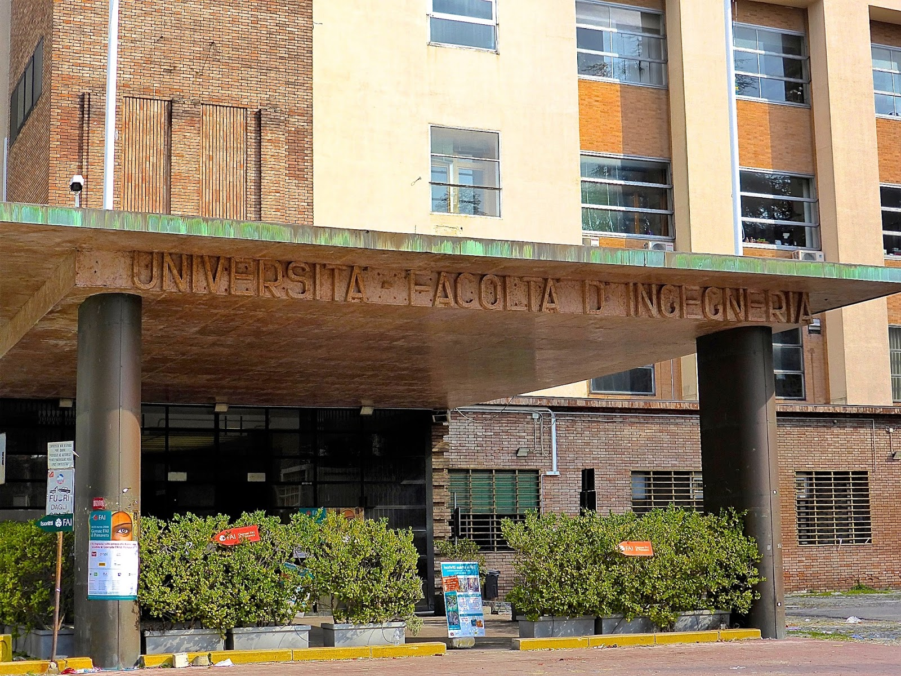

+++
title = "Weekly Meetings"
author = "Eyad"
# draft = true
+++

> ### Next Meeting
>
> The next meeting will be on Friday, 15th November 2024 at 15:00 in room 4.1 at the Risorgimento building.
>
> - [Calendar view](https://uniboaule.vercel.app/cal/5e9996a228a649001237296d/5dc56586b2285f0011f82254)
> - [Mobilizon Event](https://mobilizon.it/events/0f16240f-877c-4909-be70-1b6927354fc8)

### About

We meet every Friday at 15:00 in room 4.2 at the Risorgimento building. We hope to see you there!

We discuss about topics ranging from the latest technologies to the most recent news. We also have a lot of fun and enjoy our time together. We are always looking for new members to join us. If you are interested, please contact us or come to our next meeting!

### Location

The Risorgimento building is located in Via del Risorgimento, 2, 40136 Bologna BO, Italy. It is the historical building of the Engineering Faculty of the University of Bologna.

We meet in the "Aule Nuove" building, which is the newest building of the complex. The room 4.2 is located on the ground floor.

- [Building Map](https://mappa.ing.unibo.it/Mappe_scuola_Ingegneria_e_Architettura/Piano_Terra.html)
- [Building History](https://www.storiaememoriadibologna.it/archivio/luoghi/facolta-di-ingegneria)

### Contact

You can contact us at the following email address: [disi.ulisse@unibo.it](mailto:disi.ulisse@unibo.it)
