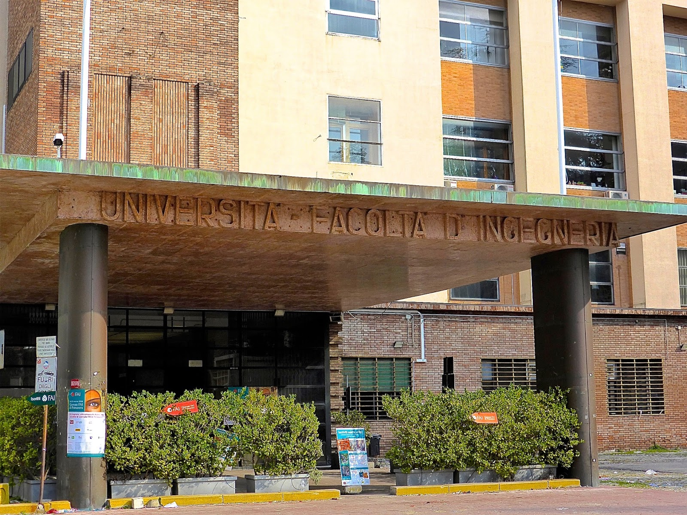

+++
title = "Weekly Meetings"
author = "Eyad"
# draft = true
+++

> ### Next Meeting
>
> The next meeting will be on Thursday, 8th October 2026 at 16:00 in laboratory 2 at the Risorgimento building.
>
> - [Calendar view](https://almaaule.vaiton.eu/cal/60f5938d5fce9400180b2e43/5dc56534b2285f0011f81a8d)

### About

We meet every Thursday at 16:00 in laboratory 2 at the Risorgimento building. We hope to see you there!

We discuss about topics ranging from the latest technologies to the most recent news. We also have a lot of fun and enjoy our time together. We are always looking for new members to join us. If you are interested, please contact us or come to our next meeting!

### Location

The Risorgimento building is located in Via del Risorgimento, 2, 40136 Bologna BO, Italy. It is the historical building of the Engineering Faculty of the University of Bologna.

We meet in the "Aule Nuove" building, which is the newest building of the complex. The laboratory 2 is located on the ground floor.

- [Building Map](https://mappa.ing.unibo.it/Mappe_scuola_Ingegneria_e_Architettura/Piano_Terra.html)
- [Building History](https://www.storiaememoriadibologna.it/archivio/luoghi/facolta-di-ingegneria)

### Contact

You can contact us at the following email address: [disi.ulisse@unibo.it](mailto:disi.ulisse@unibo.it)

If you have any questions ask in our telegram group! [Telegram](https://t.me/+2irDkiTmCBo5YmI6)