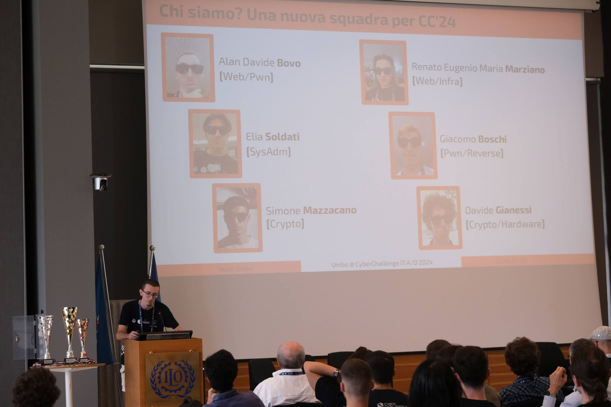

+++
title = "Ulisse @ CyberChallenge.IT 2024"
date = "2024-07-09"
draft = true
+++

Anche quest'anno l'Università di Bologna ha preso parte a [CyberChallenge.IT](https://cyberchallenge.it/), la competizione nazionale di cybersecurity organizzata dal Cybersecurity National Lab.

Il team, composto da Alan Davide Bovo, Giacomo Boschi, Davide Gianessi, Renato Eugenio Maria Marziano, Simone Mazzacano ed Elia Soldati, ha affrontato altre 42 squadre provenienti da tutta Italia in una gara CTF Attack/Defense di 7 ore, dalle 10:00 alle 17:00 del 4 luglio.

Grazie al loro impegno e alle loro competenze, il team ha conquistato un eccellente **3° posto**, totalizzando 108.631 punti, posizionandosi dietro solo a PoliTo e Sapienza.

Complimenti a tutti i partecipanti!

## Ringraziamenti

Desideriamo esprimere la nostra gratitudine al Prof. Marco Prandini per il suo supporto e coordinamento, così come a Eyad Issa, Andrea Melis, Francesco Apollonio, Santo Cariotti, Samuele Musiani, Lorenzo Rinieri e tutti i tutor del laboratorio Ulisse per il percorso formativo di CyberChallenge 2024. Ringraziamo inoltre il Cybersecurity National Lab e tutti gli sponsor nazionali che hanno reso possibile la nostra partecipazione alla competizione.

Un ringraziamento speciale va ai nostri sponsor locali: [Cyberloop], [EETECH SRLS], [Imola Informatica] e [Laboratori Guglielmo Marconi S.p.A].

[cyberloop]: https://cyberloop.it/
[EETECH SRLS]: https://eetech.it/
[Imola Informatica]: https://www.imolainformatica.it/
[Laboratori Guglielmo Marconi S.p.A]: https://labs.it/

## Workshop

Oltre alla competizione il team ha anche tenuto due presentazioni al Workshop di CyberChallenge.IT 2024:

Le presentazioni hanno illustrato strumenti sviluppati dal team di gioco e utilizzati durante la competizione, portando un vantaggio significativo alla squadra.

| Titolo | Autore | Slide | Repository GitHub |
|--------|--------|-------|-------------------|
| A/D traffic analysis with PCAP-over-IP | Eyad Issa | [PDF](./CCIT2024%20-%20Workshop%20-%20AD%20traffic%20analysis%20with%20PCAP-over-IP.pdf) | [GitHub](https://github.com/UlisseLab/pcap-broker)|
| TCP/IP fingerprinting e le sue applicazioni nel contesto delle A/D | Renato Eugenio Maria Marziano | [PDF](./CCIT2024%20-%20Workshop%20-%20Fingerprinting%20TCP-IP.pdf) | [GitHub](https://github.com/drank40/euriclea) |

## Ulteriori informazioni

CyberChallenge.IT è un programma nazionale di formazione e competizione in cybersecurity, organizzato dal Cybersecurity National Lab, che coinvolge studenti dai 16 ai 25 anni. Il programma è composto da una serie di eventi formativi e da una competizione finale, che si svolge annualmente a luglio.

Se vuoi saperne di più su CyberChallenge.IT, visita il [sito ufficiale](https://cyberchallenge.it/) e la [pagina dedicata alle iscrizioni per la prossima edizione](https://cyberchallenge.it/students).

Se vuoi entrare a far parte del nostro team, partecipare ai nostri eventi e alle nostre attività, contattaci su [Telegram](https://t.me/eyaddo) o [Discord](https://discord.gg/uwFbYA4H).
