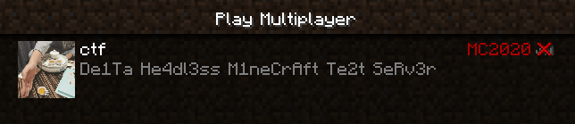
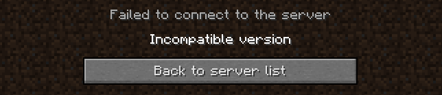
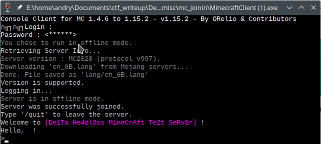
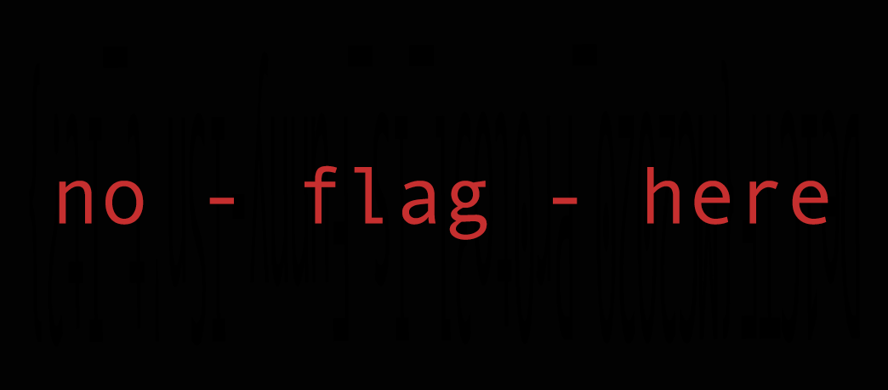
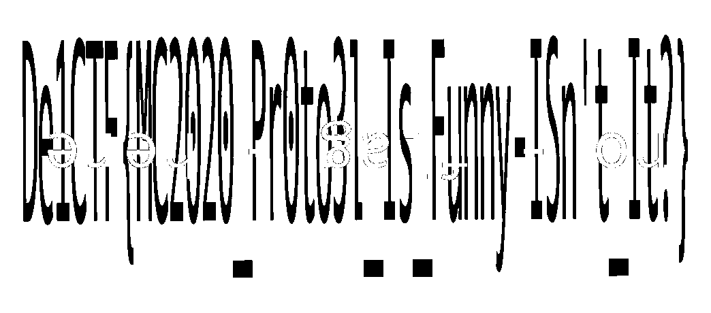

## Challenge

### Information

- category: misc
- points: 273

## Description

> 赶紧加入游戏吧。
> 我们在等你
>
> Hurry up and join in the game.
> We’re waiting for you.
>
> http://134.175.230.10/ (cn)
>
> http://222.85.25.41/ (cn)
>
> http://144.202.79.93/ (us)
>
> http://80.240.24.78/ (de)
>
> http://45.77.253.164/ (sg)

**Hint**

- mc_joinin's flag is: De1CTF{md5(flag)} mc_joinin 的 flag 格式为：De1CTF{md5(flag)}

## Writeup

### Author

[aandryyy](https://github.com/andrea-mengascini)

[fuomag9](https://github.com/fuomag9)

[Fabbrei](https://github.com/Fabbrei)

[rickycraft](https://github.com/rickycraft)

### Solution

By looking at the IP given we realized it was a Minecraft challenge.

> We1c0me t0 De1Ta He4dl3ss M1neCrAft Te2t SeRv3r
> Minecraft 20.20 is developed by De1ta Team based on 1.12
>  
> Headless
> Client isn't necessary.

Looking up at the [Minecraft Server Status](https://mcsrvstat.us/server/222.85.25.41) it showed a different version from the 1.12 reported on the website:

> MOTD De1Ta He4dl3ss M1neCrAft Te2t SeRv3r 
> Players 0 / 2147483648 
> Version **MC2020**

And looking at the debug info:

> IP address: 222.85.25.41 
> Port: 25565  > **Protocol version: 997** 
> Cached result No 
> SRV record No 
> Ping Yes 
> Query No

As the website stated a Client was not necessary. Even if the server was displayed in the Minecraft client:

It could not connect to it.

 

Indeed the version protocol use by Minecraft 1.12 is the [335](https://wiki.vg/index.php?title=Protocol&oldid=13223) and the one used in this Minecraft server is the 997, not found anywhere in the [protocol number wiki](https://wiki.vg/Protocol_version_numbers).

We didn't use a minecraft client to connect to the server but instead modified and used a [LightWeight console for minecraft chat](https://github.com/ORelio/Minecraft-Console-Client).

Changing the protocol version with `997` in this [file](https://github.com/ORelio/Minecraft-Console-Client/blob/master/MinecraftClient/Protocol/Handlers/Protocol18.cs) at row 831 this client could easily be connected with the server.

Analyzing the traffic with Wireshark we found a hidden message:

> "text":"\n\nHIDE FLAG ONE\n\n **imgur.com/a/ZOrErVM** \n\n"

Following the link we found this image:

Changing the colormap:

`De1CTF{MC2020_Pr0to3l_Is_Funny-ISn't_It?}`
