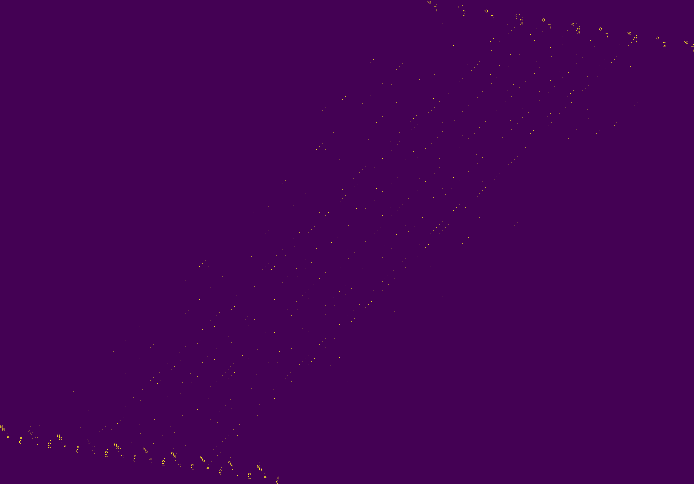

## Description

> Three hidden keys open three secret gates <br>
> Wherein the errant will be tested for worthy traits <br>
> And those with the skill to survive these straits <br>
> Will reach The End where the prize awaits <br>

Flag is in form IJCTF{copper key + jade key + crystal key} <br>

Author: `Harsh`

**Hint**

- The first clue is hidden on the website ...
- File names and titles are useful

## Solution

All this challenge is a reference to the film Ready player one as we can see in the description of the challenge. We used this information to our advantage.

## Steganography

In the main page of the challenge we found a long HTML comment: <br><br>
 <br>

Form this comment when we deleted spaces and new line and converted to ASCII:

> I created three keys. Three hidden challenges test for worthy traits revealing three hidden keys to three hidden gates. The keys aren't just laying around under a rock somewhere. I suppose you could say they're invisible, hidden in a dark room that's at the center of a maze that's located somewhere up here. Maybe you should take a closer look at our logo......................................................

So we started looking at the logo.

We found in the logo image at ijctf.ml some text. <br><br>
 <br><br>
With the help of steghide we extracted a file: <br>

```bash
steghide --extract -sf logo.jpg
```

content of the hidden File : <br>

> https://pastebin.com/Ue2VUDjk <br> > https://www.ijctf.ml/themes/core/static/img/QjMvUzIz.png <br> > https://pastebin.com/dbQXYRvZ <br>

Since the description of the challenge said that there were three parts of the key it was safe to assume every link was a different challenge.

## Copper key - Merkle–Hellman knapsack cryptosystem

### Description

M.H. is an asymmetric cryptosystem.
The public key is composed of n integer values, with n corresponding to the number of bits of the message

We define the n bits -> <br>
We define the knapsack -> <br>

cipher text = 

The private key is a superincreasing knapsack, with a multiplier and a modulus used to transform the private key in into public key.
Anyway, we don't need the private key to solve this one

We had a file containing many knapsacks of public key and the ciphertext encoded.
Every knapsack was a list of 16 integers.

### Solution

Simply trying every possible combination was an 2^16 iterations problem, so quite an easy one.

[Some code](./copper_key/expl.py)

That was it.

```
kn4ps4ck_brut3_f0rrc3_f0rrc3
```

## Jade key - Game of life

### Description

 <br><br>

The filename of the image was base64 encoded:

```bash
$ ls | cut -d '.' -f1 | base64 -d
B3/S23
```

B3/S23 stands for a set of rules for the [game of life](https://en.wikipedia.org/wiki/Life-like_cellular_automaton).<br>
We used [golly](http://golly.sourceforge.net/) to import the png file after editing the colour map with GIMP.

Running golly gave us the flag:


```
u1t1m4t3_g4m3_0f_l1f3
```

## Crystal key - Fourier series

### Description

The name of the file redirected us to a [YouTube video](https://youtu.be/r6sGWTCMz2k) about drawing with the Fourier series.

The file contained a malformed Fourier series.
After formatting the series and added the time variable that was missing we plotted it with a [numpy](./crystal_key/plot-fourier.py) function.

 <br><br>

With some imagination, you can see the text `IROK` , a character of Ready player one.

The final flag can now be submitted:
`IJCTF{kn4ps4ck_brut3_f0rrc3_u1t1m4t3_g4m3_0f_l1f3_IROK}`

## Participants

- [@aandryyy](https://github.com/andrea-mengascini)
- [@bonfee](https://github.com/Bonfee)
- [@timmykill](https://github.com/timmykill)
- [@H4R](https://github.com/Anatr1)
