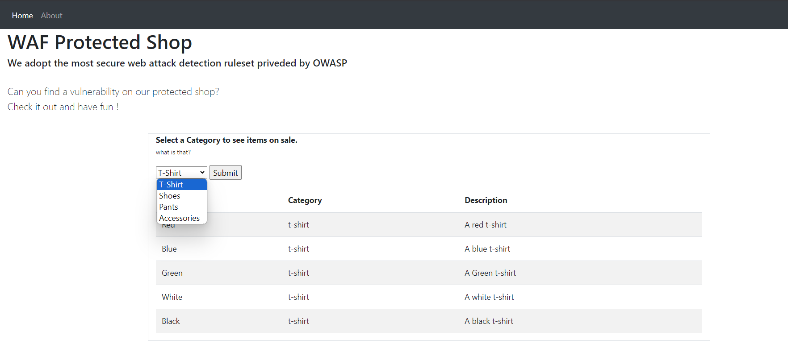
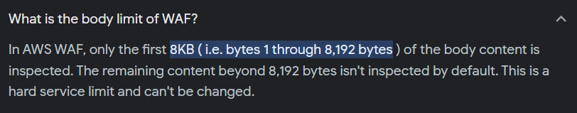
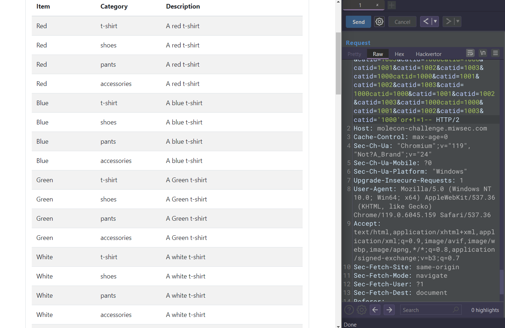
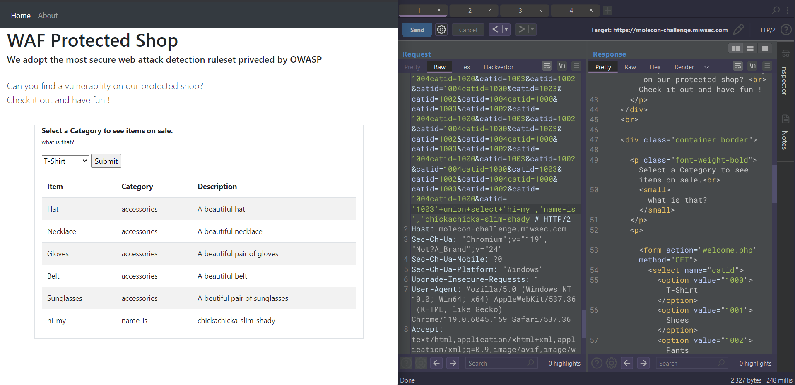
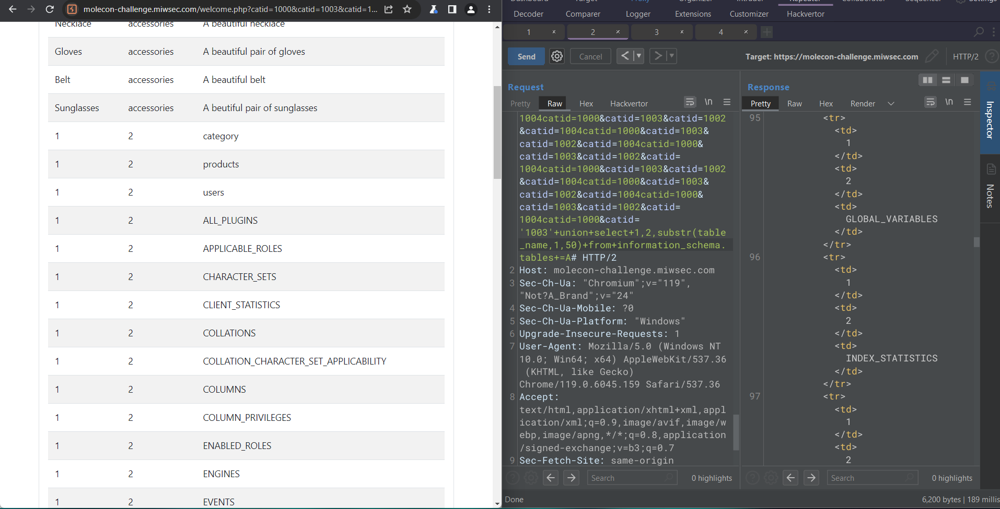
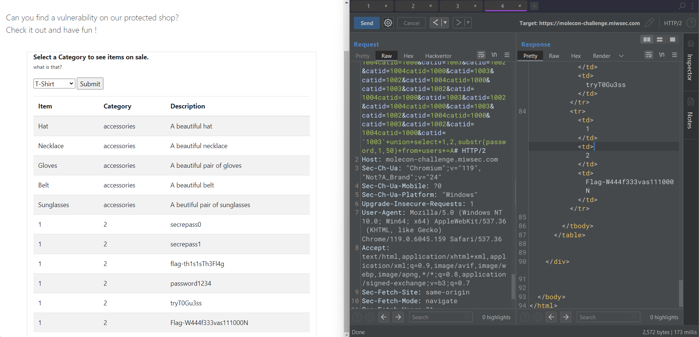

+++
title = "WAF Protected Shop"
toc = true
author = "Mastr0"
+++

# WAF Protected Shop (aizoOn)

> **Title:** WAF Protected Shop
>
> **Category:** Web
>
> **Points:** 500
>
> **Description:**
> Let us introduce you to our WAF, our customer's application has a vulnerability but with us he can sleep quite dreams. We adopt the most secure set of detection rules provided by the OWASP foundation. Can you find a way to evade our protections and take the flag?
> Attention! The flag format for this challenge is Flag-L33TsTr1nG
> Hint: Maybe not all the parameters of the requests are analyzed by the WAF
> This is a special challenge created by our sponsor aizoOn! The first PoliTO team to solve it will be awarded a special prize by them during the m0leCon 2023 Conference!

## Challenge Page

The homepage looks like this:

which is replicating a shop. The first thing that we note is the url:

* molecon-challenge.miwsec.com/**welcome.php**?catid=1000
* so we know that our website is based on `PHP`
* and probably the scope of this challenge is an SQL injection

>Our first normal request looks like this, we've found that our server is Apache
>And also there are two headers starting with X-Mithril which we'll inspect
>>HTTP/2 200 OK
>>Content-Type: text/html; charset=UTF-8
>>Vary: Accept-Encoding
>>Server: **Apache**/2.4.18 (Ubuntu)
>>**X-Mithril**-Upstream-Latency: 4
>>**X-Mithril**-Proxy-Latency: 159

## WAF recon

A quick google search for the `X-Mithril` header leads us to this page:

* <https://unire.unige.it/bitstream/handle/123456789/6781/tesi25983484.pdf?sequence=1&isAllowed=y&group=an>

Which is a thesis of a student, and on the page 14 we can see that
Mithril refeers to a WAF and is based on the **OWASP core rule set (CRS)**.

On [this github page](https://github.com/coreruleset/coreruleset/tree/v4.0/dev/rules) there are all the WAF rules that can detect

We see that most of the rules are in common with our firewall,
basically the challenge firewall can detect:

* url/double-url encoding
* /**/ -- comment for SQL (but not the # character)
* all non-alphanum characters that occurs for more than 3 times, like .... or ,%)+
* and obvoiusly the regex of most of the SQL functions/commands/quotes

So, how do we bypass that?

On the [OWASP site of SQL injection WAF bypass examples](https://owasp.org/www-community/attacks/SQL_Injection_Bypassing_WAF) most of the techniques are instantly detected by our challenge WAF, but one particular technique seems to be juicier.

## HTTP Parameter Pollution (HPP)

This technique is as old as fascinating.
Basically it consists of sending multiple parameters with the same name (or other parameters that are valid in that page)
this may cause the application to interpret values in an unantecipated way, causing the attacker to bypass input validation, trigger some errors, or even to modify internal values and many other things.
_(check out some resources at the end of the writeup)_

There is a table wich describes how some different web applications behave in this situations:

There is also our case! a **PHP/Apache** application.
but even if we try to send a few more parameters (`&catid=`), adding the malicious code to the last parameter, the WAF is still able to detect it.

So the question is, **how many parameters do i need to send?**

Another quick search encourages us to continue following this path:

Mh, maybe if we try to reach that total size only for parameters, the WAF is gonna act weird.

# &catid=WAF Bypass/solution

Let's try to send a request where all the selected parameters have a total size of 7903 bytes

And, let's add some blacklisted text to see how it reacts

**IT WORKS!!**

And after crafting a basic union select SQLi, the response looks like this:

Now that the WAF is bypassed we just have to continue our Blind SQL injection and retrieve the files, let's search for the table names:

The **users** table seem to be the most interesting

And with the last payload we were able to retrieve the flag which is:

`Flag-W444f333vas111000N`

## Useful Resources

* [WAF Bypass Cookbook](https://github.com/JnuSimba/MiscSecNotes/blob/master/Bypass%20WAF/bypass%20waf%20Cookbook.md)
* [HPP by HackTricks](https://book.hacktricks.xyz/pentesting-web/parameter-pollution)
* [Other examples of sqli WAF bypass for older versions of OWASP CRS](https://www.google.com/amp/s/www.trustwave.com/en-us/resources/blogs/spiderlabs-blog/modsecurity-sql-injection-challenge-lessons-learned/%3Fhs_amp=true)

* PPT about  HPP:
    1) [Luca Carettoni, Stefano di Paola](https://wiki.owasp.org/images/b/ba/AppsecEU09_CarettoniDiPaola_v0.8.pdf)
    2) [Marco Balduzzi](https://www.madlab.it/slides/BHEU2011/hpp-bhEU2011.pdf)
